# Development Workflow Guide

This guide explains the complete development and release workflow for the Pillar monorepo using Git Flow strategy.

## 🌊 Git Flow Strategy

The Pillar monorepo uses a Git Flow approach with two main branches:

- **`develop`** - Integration branch for ongoing development
- **`main`** - Production-ready code with releases

## 📋 Complete Workflow

### 1. 🚀 Feature Development

```bash
# Start from develop
git checkout develop
git pull origin develop

# Create feature branch
git checkout -b feature/add-new-authentication

# Develop your feature
# ... make changes ...

# Commit with conventional format
git add .
git commit -m "feat: add OAuth2 authentication support"

# Push feature branch
git push origin feature/add-new-authentication
```

### 2. 🔄 Merge Request to `develop`

```mermaid
graph LR
    A[Feature Branch] --> B[MR to develop]
    B --> C[PR Checks]
    C --> D[Code Review]
    D --> E[Merge to develop]
    E --> F[❌ No Release]
```



**What happens:**
- ✅ **Quality checks run** (lint, format, test, build)
- ✅ **Code review** by team members
- ✅ **Merge to develop** after approval
- ❌ **NO versioning or publication** - develop is for integration only

### 3. 📦 Release Preparation

When ready for a release, create a PR from `develop` to `main`:

```bash
# Ensure develop is up to date
git checkout develop
git pull origin develop

# Create release PR
git checkout -b release/prepare-v1.2.0
git push origin release/prepare-v1.2.0

# Create PR: release/prepare-v1.2.0 → main
```

### 4. 🚀 Production Release

```mermaid
graph LR
    A[develop branch] --> B[PR to main]
    B --> C[PR Checks + Version Preview]
    C --> D[Code Review]
    D --> E[Merge to main]
    E --> F[🏷️ Auto Versioning]
    F --> G[📝 Changelogs]
    G --> H[🏛️ Artifactory]
    H --> I[🚀 GitHub Release]
```



**What happens automatically:**
1. ✅ **Quality checks** (lint, format, test, build)
2. 🔮 **Version preview** in PR comments
3. 🏷️ **Automatic versioning** based on conventional commits
4. 📝 **Changelog generation** from commits since last release
5. 🏛️ **Publication to artifactory**
6. 🚀 **GitHub release creation**

## 🎯 Key Points

### ❌ No Release from `develop`
- Merging to `develop` does **NOT** trigger any release
- No versioning, no publication, no changelog updates
- `develop` is purely for integration and testing

### ✅ Release Only from `main`
- **ONLY** merging to `main` triggers the release process
- Automatic versioning based on accumulated conventional commits
- All packages with changes are versioned and published

## 📊 Branch Strategy Summary

| Branch | Purpose | CI Actions | Release |
|--------|---------|------------|---------|
| `feature/*` | Feature development | PR checks only | ❌ No |
| `develop` | Integration branch | Quality checks | ❌ No |
| `main` | Production releases | Full CI/CD pipeline | ✅ Yes |

## 🔄 Detailed Workflow Steps

### Step 1: Feature Development
```bash
# 1. Create feature branch from develop
git checkout develop
git pull origin develop
git checkout -b feature/your-feature-name

# 2. Develop with conventional commits
git commit -m "feat: add new feature"
git commit -m "fix: resolve bug in feature"
git commit -m "docs: update feature documentation"

# 3. Push and create MR to develop
git push origin feature/your-feature-name
# Create MR: feature/your-feature-name → develop
```

### Step 2: Integration on `develop`
```bash
# After MR approval and merge
git checkout develop
git pull origin develop
# Your feature is now integrated
```

### Step 3: Release Preparation
```bash
# When ready for release
git checkout develop
git pull origin develop

# Optional: create release branch for final touches
git checkout -b release/v1.2.0
# Make any final adjustments
git commit -m "chore: prepare release v1.2.0"
git push origin release/v1.2.0

# Create PR: release/v1.2.0 → main (or develop → main directly)
```

### Step 4: Production Release
```bash
# After PR approval and merge to main
# CI automatically:
# 1. Analyzes all commits since last release
# 2. Determines version bumps based on conventional commits
# 3. Updates package versions
# 4. Generates changelogs
# 5. Publishes to artifactory
# 6. Creates GitHub release
```

## 🏷️ Version Determination

The CI analyzes **ALL** commits between the last release and current `main` to determine versions:

```bash
# Example commit history since last release:
git log --oneline last-release..HEAD

fix: resolve memory leak in provider          # → PATCH
feat: add new authentication method          # → MINOR  
docs: update API documentation              # → No version change
feat!: redesign dependency injection API    # → MAJOR (breaking)
```

**Result**: Major version bump due to breaking change

## 🎨 PR Comments and Previews

When creating a PR to `main`, the CI will comment with:

```markdown
🔮 Version Preview

This PR will affect the following packages:
- pillar_core: 1.1.0 → 2.0.0 (major - breaking changes)
- pillar_remote_config: 1.1.0 → 2.0.0 (major - dependency update)

⚠️ Breaking Changes Detected
This PR contains breaking changes and will trigger a MAJOR version bump.

Commits analyzed:
- feat!: redesign dependency injection API
- feat: add new authentication method
- fix: resolve memory leak in provider
```

## 🔥 Hotfix Workflow

For urgent fixes that need immediate release:

```bash
# 1. Create hotfix branch from main
git checkout main
git pull origin main
git checkout -b hotfix/critical-security-fix

# 2. Make the fix
git commit -m "fix: resolve critical security vulnerability"

# 3. Create PR directly to main
git push origin hotfix/critical-security-fix
# Create PR: hotfix/critical-security-fix → main

# 4. After merge, CI creates patch release automatically

# 5. Merge back to develop
git checkout develop
git merge main
git push origin develop
```

## 📈 Best Practices

### Conventional Commits
Always use conventional commit format for automatic versioning:

```bash
# Good commits
git commit -m "feat: add user authentication"
git commit -m "fix: resolve memory leak"
git commit -m "feat!: redesign API (breaking change)"

# Bad commits (won't trigger proper versioning)
git commit -m "update code"
git commit -m "fix bug"
git commit -m "changes"
```

### Branch Naming
Use consistent branch naming:

```bash
feature/add-authentication
feature/improve-performance
fix/memory-leak-issue
hotfix/security-vulnerability
release/v1.2.0
```

### PR Management
- Use descriptive PR titles with conventional commit format
- Review version preview comments before merging to main
- Coordinate breaking changes across team

## 🚨 Important Notes

1. **Only `main` triggers releases** - develop merges do not create releases
2. **Accumulative versioning** - CI analyzes all commits since last release
3. **Breaking changes propagate** - breaking changes in core packages bump dependent packages
4. **Automatic dependency updates** - Melos handles inter-package dependencies
5. **No manual versioning** - All versioning is controlled by CI

## 📊 Monitoring

After a release to main, check:

- ✅ **GitHub Actions** - All jobs completed successfully
- ✅ **GitHub Releases** - New release created with changelog
- ✅ **Artifactory** - Packages published successfully
- ✅ **Git Tags** - Individual package tags created
- ✅ **Changelogs** - Updated with new entries

---

This workflow ensures clean separation between development integration (`develop`) and production releases (`main`), with full automation of the release process.
