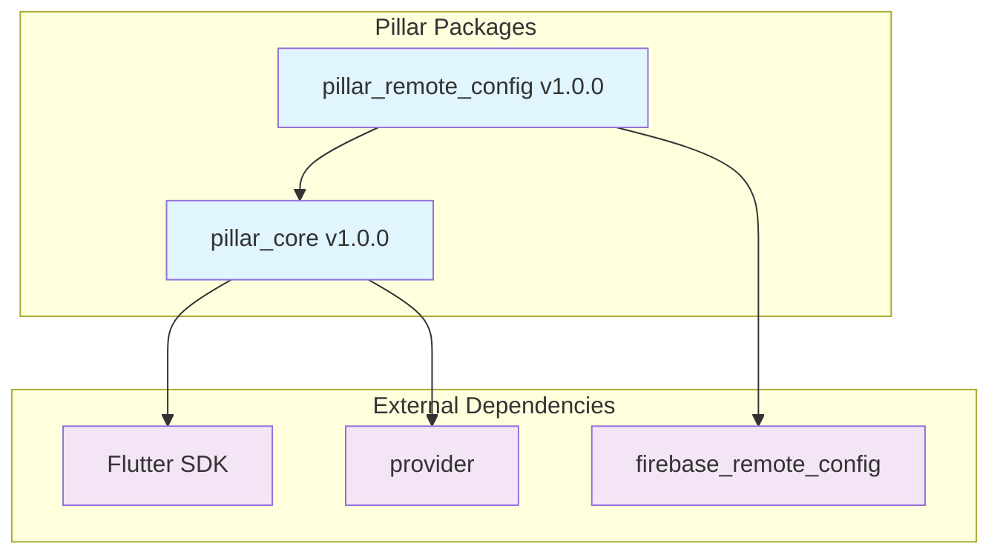

# Publishing to pub.dev

This guide explains how to publish packages from the Pillar monorepo to pub.dev.

## 📋 Table of Contents

- [Overview](#overview)
- [Prerequisites](#prerequisites)
- [Package Configuration](#package-configuration)
- [Authentication](#authentication)
- [Publishing Process](#publishing-process)
- [Troubleshooting](#troubleshooting)

## 🎯 Overview

The Pillar monorepo publishes packages to **pub.dev**, the official Dart and Flutter package repository. All packages are configured to be published as open-source packages.

## ✅ Prerequisites

### 1. pub.dev Account
- Create an account at [pub.dev](https://pub.dev)
- Verify your email address
- Set up two-factor authentication (recommended)

### 2. Package Publisher Rights
- You must be added as a publisher for each package
- For new packages, the first publisher is automatically set when publishing

### 3. Local Authentication
```bash
# Authenticate locally (required for first-time publishing)
dart pub login
```

## 🔧 Package Configuration

### Required Metadata
Each package must have the following metadata in `pubspec.yaml`:

```yaml
name: pillar_core
version: 1.0.0
description: Core package with clean architecture foundation and dependency injection
homepage: https://github.com/Core-Soft-Development/pillar
repository: https://github.com/Core-Soft-Development/pillar
issue_tracker: https://github.com/Core-Soft-Development/pillar/issues

environment:
  sdk: ">=3.6.0 <4.0.0"
  flutter: ">=3.0.0"
```

### Package Validation
Before publishing, ensure:
- ✅ Package name follows pub.dev naming conventions
- ✅ Version follows semantic versioning
- ✅ Description is clear and informative
- ✅ All required metadata is present
- ✅ Package passes `dart pub publish --dry-run`

## 🔐 Authentication

### Local Development
```bash
# Login to pub.dev (interactive)
dart pub login

# Verify authentication
dart pub token list
```

### CI/CD (GitHub Actions)
1. **Generate Token:**
   ```bash
   # After logging in locally
   cat ~/.pub-cache/credentials.json
   # Copy the "accessToken" value
   ```

2. **Add GitHub Secret:**
   - Go to repository Settings → Secrets and variables → Actions
   - Add new secret: `PUB_TOKEN`
   - Value: Your access token from step 1

3. **Workflow Usage:**
   ```yaml
   - name: 📦 Publish to pub.dev
     env:
       PUB_TOKEN: ${{ secrets.PUB_TOKEN }}
     run: |
       echo "$PUB_TOKEN" | dart pub token add https://pub.dartlang.org
       melos publish --no-dry-run --yes
   ```

## 🚀 Publishing Process

### Manual Publishing

#### Single Package
```bash
# Navigate to package directory
cd packages/pillar-core

# Dry run (validate without publishing)
dart pub publish --dry-run

# Publish
dart pub publish
```

#### All Packages (Melos)
```bash
# Dry run all packages
melos publish --dry-run

# Publish all changed packages
melos publish --no-dry-run --yes
```

### Automated Publishing (CI/CD)

Publishing is automatically triggered when:
1. Changes are pushed to `main` branch
2. Conventional commit messages indicate package changes
3. All quality checks pass (lint, format, test, build)

**Workflow:**
1. 🔍 **Detect Changes** - Identify modified packages
2. 📈 **Version Bump** - Update versions based on conventional commits
3. 📝 **Update Changelogs** - Generate changelog entries
4. 🏷️ **Create Git Tags** - Tag new versions
5. 📦 **Publish to pub.dev** - Upload packages
6. 🚀 **GitHub Release** - Create GitHub release with notes

## 📊 Package Status

### Current Packages

| Package | Status | Version | pub.dev |
|---------|--------|---------|---------|
| `pillar_core` | ✅ Ready | 1.0.0 | [View](https://pub.dev/packages/pillar_core) |
| `pillar_remote_config` | ✅ Ready | 1.0.0 | [View](https://pub.dev/packages/pillar_remote_config) |

### Package Dependencies


## 🔧 Troubleshooting

### Common Issues

#### Authentication Failed
```
Error: 401 Unauthorized when accessing https://pub.dartlang.org
```
**Solution:**
1. Check `PUB_TOKEN` is correct and not expired
2. Re-authenticate: `dart pub login`
3. Update GitHub secret with new token

#### Package Already Exists
```
Error: Package already exists
```
**Solution:**
1. Check if you're a publisher: Visit package page on pub.dev
2. Request publisher access from existing publishers
3. Or choose a different package name

#### Version Already Published
```
Error: Version 1.0.0 of package_name already exists
```
**Solution:**
1. Increment version in `pubspec.yaml`
2. Use Melos versioning: `melos version --manual`
3. Ensure CI properly increments versions

#### Missing Publisher Permissions
```
Error: Insufficient permissions to publish
```
**Solution:**
1. Visit package page on pub.dev
2. Request publisher access from existing publishers
3. Or create package with different name

#### Validation Failed
```
Error: Package validation failed
```
**Solution:**
1. Run `dart pub publish --dry-run` to see specific issues
2. Fix validation errors (missing metadata, etc.)
3. Ensure all required fields are present

### Verification Commands

```bash
# Check package health
dart pub deps

# Validate before publishing
dart pub publish --dry-run

# Check published versions
dart pub deps --style=list | grep pillar

# Verify authentication
dart pub token list
```

### Getting Help

1. **pub.dev Documentation**: [https://dart.dev/tools/pub/publishing](https://dart.dev/tools/pub/publishing)
2. **GitHub Issues**: Create an issue in this repository
3. **Melos Documentation**: [https://melos.invertase.dev](https://melos.invertase.dev)

## 🎯 Best Practices

### Version Management
- Use semantic versioning (major.minor.patch)
- Follow conventional commits for automatic versioning
- Test packages locally before publishing
- Use `--dry-run` to validate before publishing

### Quality Assurance
- All packages pass linting and formatting checks
- Comprehensive test coverage
- Documentation is up-to-date
- Examples work correctly

### Release Strategy
- Publish breaking changes as major versions
- Use prerelease versions for testing (1.0.0-beta.1)
- Coordinate releases of dependent packages
- Update dependent packages when dependencies change

### Security
- Rotate pub.dev tokens regularly
- Use minimal required permissions
- Never commit tokens to repository
- Monitor package downloads and usage

For more details, see:
- [CI/CD Documentation](CI-CD.md)
- [Versioning Guide](VERSIONING.md)
- [Development Workflow](DEVELOPMENT-WORKFLOW.md)
